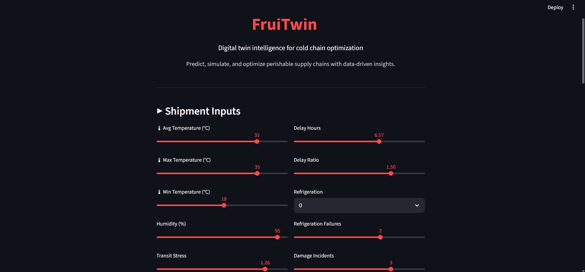
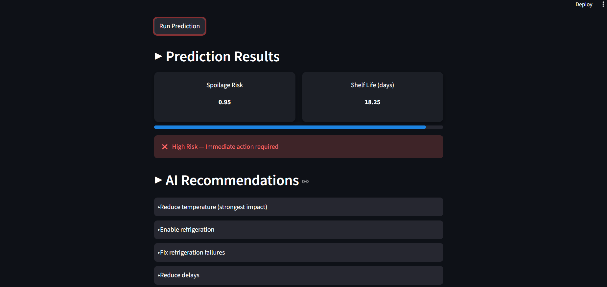
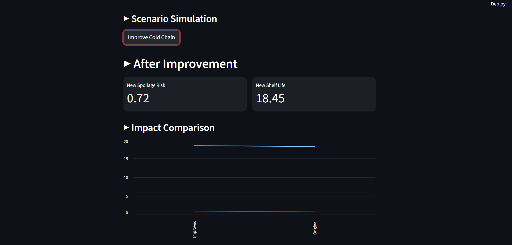
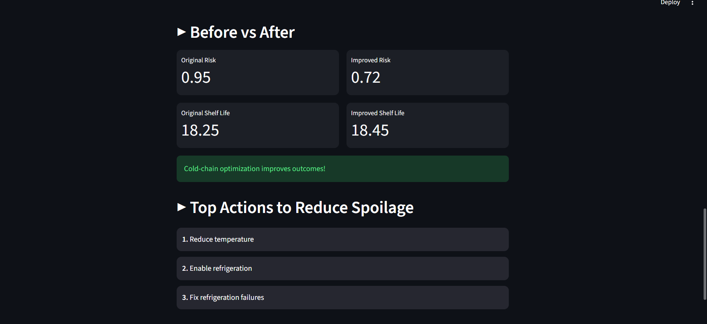

# FruiTwin  
### Digital Twin Intelligence for Cold Chain Optimization  

**Predict, simulate, and optimize perishable supply chains with data-driven insights.**

---

## Overview  

**FruiTwin** is an end-to-end machine learning system designed to analyze and optimize fruit supply chain logistics.  

It leverages predictive modeling and scenario simulation to:
- Estimate spoilage risk  
- Predict remaining shelf life  
- Recommend actionable improvements  
- Simulate logistics interventions  

This transforms raw supply chain data into **intelligent, decision-ready insights**.

---

## Key Features  

### Spoilage Risk Prediction  
Predicts the probability of spoilage using an XGBoost classification model.

### Shelf Life Estimation  
Estimates remaining shelf life using a Random Forest regression model.

### Smart Recommendations  
Provides ranked actions to reduce spoilage risk:
- Temperature control  
- Refrigeration optimization  
- Delay reduction  
- Packaging improvements  

### Scenario Simulation  
Simulate improvements (e.g., better cold chain) and instantly see:
- Risk reduction  
- Shelf life improvement  

### Impact Visualization  
Compare **before vs after** scenarios using charts and metrics.

---

## Tech Stack  

- **Python**
- **Streamlit** – UI & deployment  
- **Scikit-learn** – ML pipelines  
- **XGBoost** – Classification model  
- **Pandas / NumPy** – Data processing  

---

## Demo

 
 
 
 

---

## Project Structure  

```
fruit-spoilage-app/
│
├── app.py
├── xgb_model.pkl
├── rf_reg.pkl
├── fruit_supply_chain_dataset.csv
└── README.md
```

---

## Installation & Setup  

### 1. Clone the repository
```bash
git clone https://github.com/IshaanMig2507/FruiTwin.git
cd FruiTwin
```

### 2. Create virtual environment
```bash
python -m venv venv
venv\Scripts\activate
```

### 3. Install dependencies
```bash
pip install streamlit pandas scikit-learn xgboost joblib
```

---

## Run the App  

```bash
python -m streamlit run app.py
```

Open in browser:
```
http://localhost:8501
```

---

## How It Works  

1. Input shipment conditions:
   - Temperature  
   - Humidity  
   - Delay  
   - Refrigeration  

2. Models process data:
   - **XGBoost → Spoilage probability**
   - **Random Forest → Shelf life**

3. Outputs:
   - Risk score  
   - Shelf life estimate  
   - Recommended actions  

4. Scenario simulation:
   - Applies improvements  
   - Shows measurable impact  

---

## Example Insights  

- Temperature deviation is the strongest driver of spoilage  
- Cold-chain effectiveness significantly reduces risk  
- Delay and damage contribute cumulatively  

---

## Use Cases  

- Supply chain optimization  
- Cold chain monitoring  
- Logistics decision support  
- Risk analysis for perishable goods  

---

## Future Improvements  

- Real-time IoT integration  
- Explainability (SHAP)  
- Cloud deployment  

---

## Project Highlight  

> Built an end-to-end decision intelligence system combining predictive modeling, scenario simulation, and actionable insights for optimizing perishable supply chains.

---

## 📌 Author  

**Ishaan Miglani**

